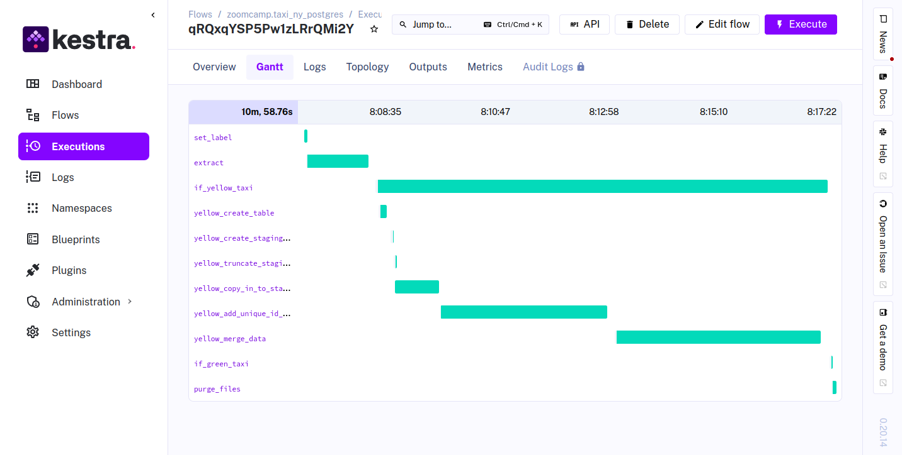
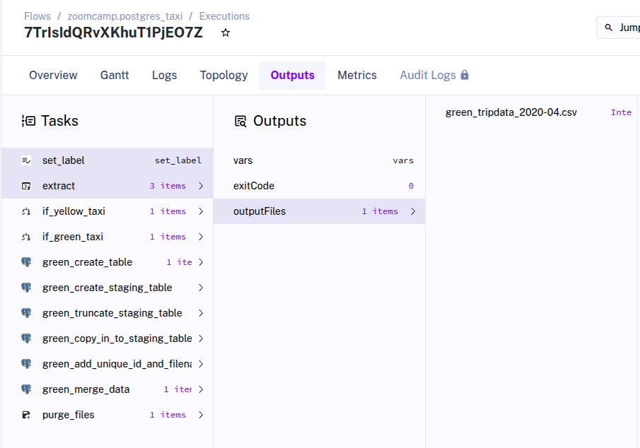
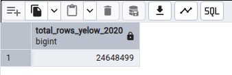
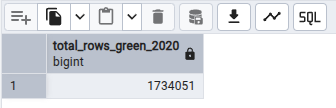
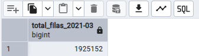

# Data Engineering Zoomcamp - 01. Docker - Terraform

## Introduction
This repository contains the methods and codes to solve the questions of the `First Partial`of the **course `Data Engineering Zoomcamp`cohort-2025**
The repository has the following structure:
```
```tree
.
├── flow
│   ├── 01_postgres_taxi.yaml
│   ├── 02_postgres_taxi_scheduled.yaml
│   └── 03_postgres_dbt.yaml
├── img
│   ├── green_tripdata_2020-04.csv.png
│   ├── kestra_extract_data.png
│   ├── total_row_yelow_2021-03.png
│   ├── total_rows_green_2020.png
│   └── total_rows_yelow_2020.png
├── docker-compose.yaml
└── README.md

```
* `flow`: flow file for kestra  (.yaml files).
    * `01_postgres_taxi.yaml`: flow file to extract taxis data.
    * `02_postgres_taxi_scheduled.yaml`: flow file to extract taxis data - scheduled.
    * `03_postgres_dbt.yaml`: flow file to work with dbt.
* `docker-compose.yaml`: File to define and run multi-container Docker applications in this case Postgresql, Kestra and pgadmin.
* `README.md`: This file

The procedure used to solve the problems raised was carried out following the following steps:
- creation of containers through the docker-compose.yml file
```zsh
❯ cd 02-workflow-orchestration
❯ ls
    docker-compose.yml  flows  img  README.md
❯ docker-compose up -d    
```
- data ingestion into the posgresql database through Kestra slacks.

- Evaluation of the questions through verification and SQL queries

## Quiz Answers:

### Question 1.
Within the execution for Yellow Taxi data for the year 2020 and month 12: what is the uncompressed file size (i.e. the output file yellow_tripdata_2020-12.csv of the extract task)?

* ## Answer: 134.5 MB

### Question 2.
What is the rendered value of the variable file when the inputs taxi is set to green, year is set to 2020, and month is set to 04 during execution?



* ## Answer: green_tripdata_2020-04.csv

### Question 3.
How many rows are there for the Yellow Taxi data for all CSV files in the year 2020?

To answer the following question, a query is made as specified:
```sql
SELECT COUNT(*) AS total_rows_yellow_2020
FROM yellow_tripdata
WHERE filename LIKE '%2020%';
```


* ## Answer: 24,648,499

### Question 4.
How many rows are there for the Green Taxi data for all CSV files in the year 2020?

To answer the following question, a query is made as specified:
```sql
SELECT COUNT(*) AS total_rows_green_2020
FROM green_tripdata
WHERE filename LIKE '%2020%';
``` 

* ## Answer: 1,734,051

### Question 5.
How many rows are there for the Yellow Taxi data for the March 2021 CSV file?

To answer the following question, a query is made as specified:
```sql
SELECT COUNT(*) AS "total_filas_2021-03"
FROM yellow_tripdata
WHERE filename = 'yellow_tripdata_2021-03.csv';

``` 


* ## Answer: 1,925,152

### Question 6.
How would you configure the timezone to New York in a Schedule trigger?

* ## Answer: Add a timezone property set to America/New_York in the Schedule trigger configuration

