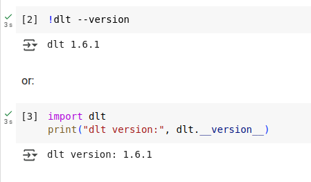
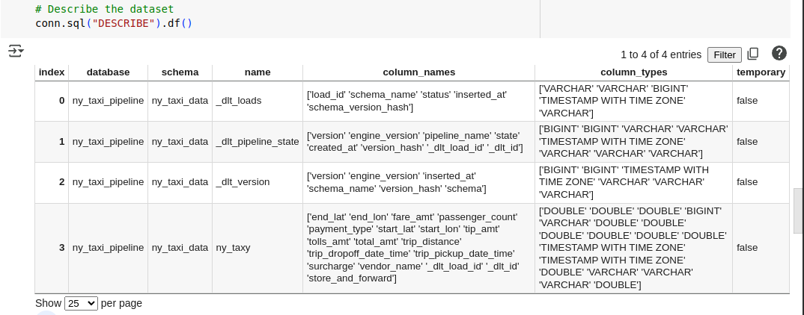
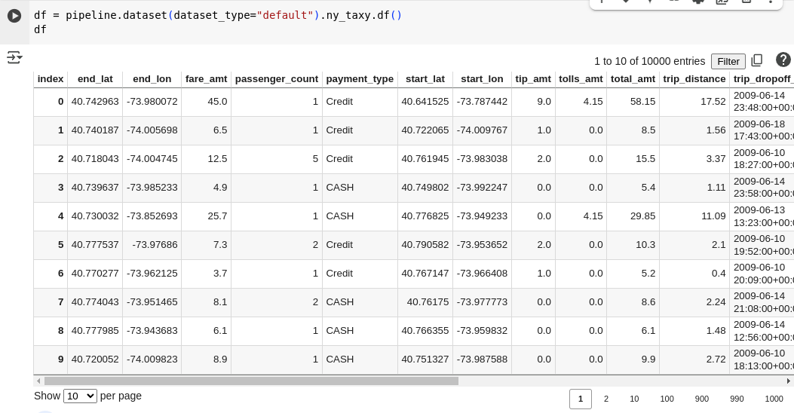
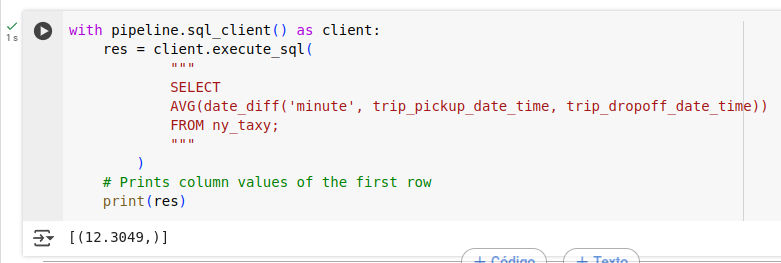

# **Workshop "Data Ingestion with dlt": Homework**

## **Question 1: dlt Version**

1. **Install dlt**:

```
!pip install dlt[duckdb]
```

2. **Check** the version:

```
!dlt --version
```

or:

```py
import dlt
print("dlt version:", dlt.__version__)
```

Provide the **version** you see in the output.



#### Answer dlt version: 1.6.1

## **Question 2: Define & Run the Pipeline (NYC Taxi API)**

Use dlt to extract all pages of data from the API.

Steps:

1️⃣ Use the `@dlt.resource` decorator to define the API source.

2️⃣ Implement automatic pagination using dlt's built-in REST client.

3️⃣ Load the extracted data into DuckDB for querying.

```py
import dlt
from dlt.sources.helpers.rest_client import RESTClient
from dlt.sources.helpers.rest_client.paginators import PageNumberPaginator


# your code is here
@dlt.resource(name='ny_taxy')
def ny_taxi():
    client = RESTClient(
        base_url="https://us-central1-dlthub-analytics.cloudfunctions.net",
        paginator=PageNumberPaginator(
            base_page=1,
            total_path=None
        )
    )

    for page in client.paginate("data_engineering_zoomcamp_api"):    # <--- API endpoint for retrieving taxi ride data
        yield page   # <--- yield data to manage memory


pipeline = dlt.pipeline(
    pipeline_name="ny_taxi_pipeline",
    destination="duckdb",
    dataset_name="ny_taxi_data"
)
```

Load the data into DuckDB to test:
```py
load_info = pipeline.run(ny_taxi)
print(load_info)
```
Start a connection to your database using native `duckdb` connection and look what tables were generated:"""

```py
import duckdb
from google.colab import data_table
data_table.enable_dataframe_formatter()

# A database '<pipeline_name>.duckdb' was created in working directory so just connect to it

# Connect to the DuckDB database
conn = duckdb.connect(f"{pipeline.pipeline_name}.duckdb")

# Set search path to the dataset
conn.sql(f"SET search_path = '{pipeline.dataset_name}'")

# Describe the dataset
conn.sql("DESCRIBE").df()

```

How many tables were created?



#### Answe  4

## **Question 3: Explore the loaded data**

Inspect the table `ride`:

```py
df = pipeline.dataset(dataset_type="default").rides.df()
df
```

What is the total number of records extracted?



#### Answer 10000

## **Question 4: Trip Duration Analysis**

Run the SQL query below to:

* Calculate the average trip duration in minutes.

```py
with pipeline.sql_client() as client:
    res = client.execute_sql(
            """
            SELECT
            AVG(date_diff('minute', trip_pickup_date_time, trip_dropoff_date_time))
            FROM rides;
            """
        )
    # Prints column values of the first row
    print(res)
```

What is the average trip duration?



#### Answer  12.3049