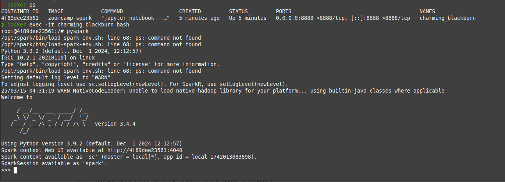
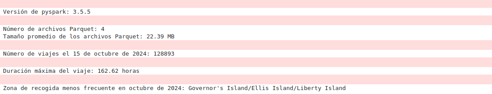

# Module 5 Homework

## Preliminary:

To carry out this practice, a Docker image was created using the following Dockerfile

```bash

FROM openjdk:11-jdk-slim

# Instalar dependencias
RUN apt-get update && apt-get install -y python3 python3-pip wget

# Descargar y extraer Spark
RUN wget https://dlcdn.apache.org/spark/spark-3.4.4/spark-3.4.4-bin-hadoop3.tgz && \
    tar -xzf spark-3.4.4-bin-hadoop3.tgz -C /opt && \
    mv /opt/spark-3.4.4-bin-hadoop3 /opt/spark

# Configurar variables de entorno
ENV SPARK_HOME /opt/spark
ENV PATH $SPARK_HOME/bin:$PATH
ENV PYSPARK_PYTHON python3
ENV PYSPARK_DRIVER_PYTHON python3

# Instalar PySpark
RUN pip3 install pyspark jupyter notebook

# Configurar Jupyter Notebook para permitir acceso remoto (opcional, pero recomendado)
RUN jupyter notebook --generate-config

# Configurar Jupyter Notebook para permitir acceso remoto sin token (para desarrollo local, no para producción)
RUN echo "c.NotebookApp.token = ''" >> /root/.jupyter/jupyter_notebook_config.py
RUN echo "c.NotebookApp.password = ''" >> /root/.jupyter/jupyter_notebook_config.py
RUN echo "c.NotebookApp.ip = '0.0.0.0'" >> /root/.jupyter/jupyter_notebook_config.py
RUN echo "c.NotebookApp.allow_root = True" >> /root/.jupyter/jupyter_notebook_config.py

# Exponer el puerto de Jupyter Notebook
EXPOSE 8888

# Comando para iniciar Jupyter Notebook
CMD ["jupyter", "notebook", "--allow-root"]

``` 

## How to build and run the image:

- Save the Dockerfile as a `Dockerfile`.
- Build the image: `docker build -t spark-jupyter .`
- Run the container: `docker run -p 8888:8888 spark-jupyter`
- Now, I access Jupyter Notebook in my browser at `http://localhost:8888`.


## Question 1: Install Spark and PySpark

- Install Spark
- Run PySpark
- Create a local spark session
- Execute spark.version.

What's the output?

## Answer
spark.version

version 3.4.4

pyspark version

version 3.5.5

## Question 2: Yellow October 2024

Read the October 2024 Yellow into a Spark Dataframe.

Repartition the Dataframe to 4 partitions and save it to parquet.

What is the average size of the Parquet (ending with .parquet extension) Files that were created (in MB)? Select the answer which most closely matches.


## Answer 25MB

## Question 3: Count records 

How many taxi trips were there on the 15th of October?

Consider only trips that started on the 15th of October.


## Answer 125.567

## Question 4: Longest trip

What is the length of the longest trip in the dataset in hours?


## Answer 162

## Question 5: User Interface

Spark’s User Interface which shows the application's dashboard runs on which local port?

## Answer 4040

## Question 6: Least frequent pickup location zone

Using the zone lookup data and the Yellow October 2024 data, what is the name of the LEAST frequent pickup location Zone?


## Answer Governor's Island/Ellis Island/Liberty Island
